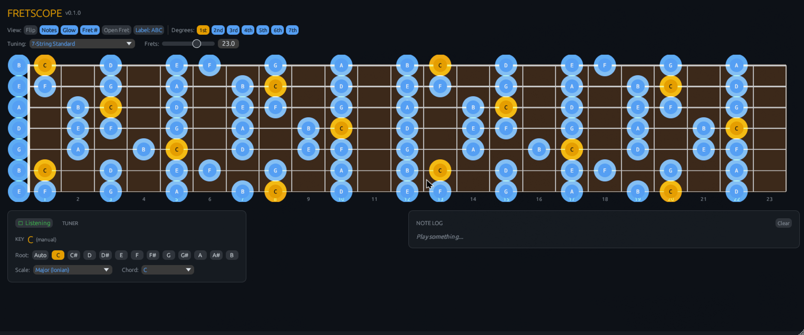
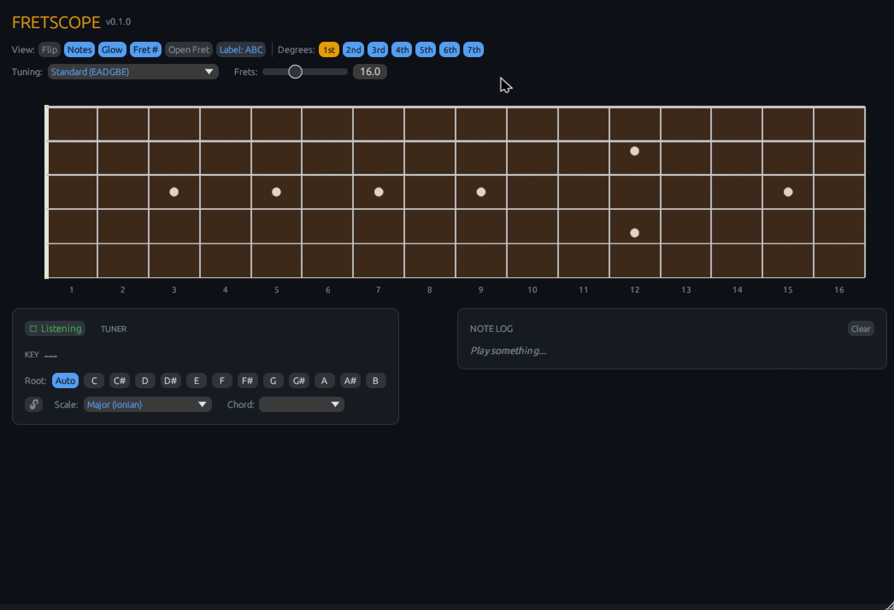

<a id="readme-top"></a>

[![Contributors][contributors-shield]][contributors-url]
[![Forks][forks-shield]][forks-url]
[![Stargazers][stars-shield]][stars-url]
[![Issues][issues-shield]][issues-url]
[![MIT License][license-shield]][license-url]
[](https://github.com/jacob-sabella/fretscope/actions/workflows/build.yml)

# Fretscope

Real-time pitch and key detection with guitar fretboard visualization. Runs as a **VST3/CLAP plugin** (load in any DAW) or as a **standalone app**.

Cross-platform: **Linux**, **macOS**, and **Windows**. Built for guitar players who want Scaler-style detection with a fretboard-first workflow.





## Features

### Pitch Detection
- Real-time chromatic detection via McLeod algorithm, optimized for guitar (50-2000 Hz)
- 2048-sample window with 50% overlap (~23ms latency at 44.1kHz)
- Configurable confidence threshold
- Listen/Pause toggle (spacebar shortcut)

### Key Detection
- Krumhansl-Schmuckler algorithm with exponential decay weighting
- Floating mode (auto-updates as you play) or locked mode
- Click any detected alternate key to select it
- Manual root note selection (all 12 notes)

### Fretboard Visualization
- Resizable window with responsive layout
- Configurable fret count (8-30 frets) for extended range playing
- Color-coded scale overlays (root = amber, scale tones = blue)
- Active note glow/pulse animation
- Fret markers, proportional string thickness, nut rendering
- Display options:
  - **Flip** — swap low/high string orientation
  - **Notes** — show/hide note labels
  - **Glow** — show/hide glow effects
  - **Fret numbers** — show/hide fret numbers
  - **Open Fret** — show fret 0 as a column on the board
  - **Label mode** — cycle between note letters (A B C), scale degrees (1 2 3), or both
  - **Degree filters** — toggle individual scale degrees (1st, 2nd, 3rd, ...) to isolate patterns

### Tuning Support
- 13 preset tunings:
  - 6-string: Standard, Drop D, Drop C, Open G, Open D, DADGAD, Half/Full Step Down
  - 7-string: Standard, Drop A
  - 8-string: Standard
  - Bass: 4-string, 5-string
- **Custom tuning** — any number of strings (1-12), per-string semitone adjustment

### Scale & Chord Browser
- 15 scale types: major, natural/harmonic/melodic minor, pentatonic major/minor, blues, whole tone, diminished, and all 7 modes (dorian, phrygian, lydian, mixolydian, aeolian, locrian)
- 11 chord types: major, minor, dom7, maj7, min7, dim, aug, sus2, sus4, add9, power
- Dropdown selectors for quick access

### Tuner
- Cents offset display with color-coded accuracy (green/amber/red)
- Visual needle bar (-50 to +50 cents)

### Note Log
- Timestamped detection history with phrase grouping
- Deduplication (only logs on note change)
- In-key/out-of-key color coding
- Scrollable with clear button

### Multi-Instance
- Run multiple independent instances in your DAW
- Each instance has its own tuning, scale, display settings

## Install

Download a pre-built release from the [Releases page](https://github.com/jacob-sabella/fretscope/releases) or build from source.

### From release (recommended)

Download the archive for your platform, extract, and copy to your plugin directory:

| Platform | VST3 Location | CLAP Location |
|----------|--------------|---------------|
| Linux | `~/.vst3/` | `~/.clap/` |
| macOS | `~/Library/Audio/Plug-Ins/VST3/` | `~/Library/Audio/Plug-Ins/CLAP/` |
| Windows | `C:\Program Files\Common Files\VST3\` | `C:\Program Files\Common Files\CLAP\` |

### From source (Linux/macOS)

```bash
make install      # build + copy to standard plugin dirs
make uninstall    # remove
make clean        # wipe build artifacts
```

### From source (any platform)

```bash
cargo xtask bundle fretscope --release
# Bundles appear in target/bundled/
```

## Usage

### As a plugin

1. Open your DAW (e.g., Carla, REAPER, Bitwig, Ableton, FL Studio)
2. Rescan plugins if needed
3. Add **Fretscope** to a track
4. Route audio input to the plugin

### Standalone

```bash
fretscope --backend jack   # JACK (Linux)
fretscope --backend alsa   # ALSA (Linux)
# macOS/Windows: uses default audio backend
```

### Keyboard Shortcuts

| Key   | Action              |
|-------|---------------------|
| Space | Toggle listen/pause |

## Build from Source

Requires Rust 1.70+ and standard Linux audio development headers.

```bash
# Development build
cargo build

# Bundle VST3/CLAP/standalone
cargo xtask bundle fretscope --release

# Run tests
cargo test --lib
```

## Architecture

```
Audio Thread (real-time)          GUI Thread (egui)
┌──────────┐  ┌──────────┐      ┌─────────────────────┐
│ Plugin   │─>│ Pitch    │─────>│ Fretboard Canvas    │
│ process()│  │ Detector │ ring │ Key/Scale Panel     │
└──────────┘  └──────────┘ buf  │ Tuner               │
                    │           │ Note Log             │
                    v           └─────────────────────┘
              ┌──────────┐
              │ Key      │
              │ Detector │
              └──────────┘
```

- **Audio thread**: Real-time safe. Pitch detector accumulates samples internally across process blocks.
- **Key detection**: Pearson correlation of rolling pitch class histogram against Krumhansl-Kessler major/minor profiles.
- **GUI**: egui immediate-mode rendering with custom-painted fretboard. Dark pro-audio theme.

## Dependencies

| Crate           | Purpose                          |
|-----------------|----------------------------------|
| nih-plug        | VST3/CLAP plugin framework       |
| nih-plug-egui   | GUI via egui                     |
| pitch-detection | McLeod pitch detection algorithm |
| atomic_float    | Lock-free float for tuner data   |

## Vibe Coded

This entire project was vibe coded with [Claude Code](https://claude.ai/claude-code). Architecture, implementation, UI design, music theory engine, pitch detection pipeline — all of it. No hand-written code.

## License

Distributed under the MIT License. See [LICENSE](LICENSE).

[contributors-shield]: https://img.shields.io/github/contributors/jacob-sabella/fretscope.svg?style=for-the-badge
[contributors-url]: https://github.com/jacob-sabella/fretscope/graphs/contributors
[forks-shield]: https://img.shields.io/github/forks/jacob-sabella/fretscope.svg?style=for-the-badge
[forks-url]: https://github.com/jacob-sabella/fretscope/network/members
[stars-shield]: https://img.shields.io/github/stars/jacob-sabella/fretscope.svg?style=for-the-badge
[stars-url]: https://github.com/jacob-sabella/fretscope/stargazers
[issues-shield]: https://img.shields.io/github/issues/jacob-sabella/fretscope.svg?style=for-the-badge
[issues-url]: https://github.com/jacob-sabella/fretscope/issues
[license-shield]: https://img.shields.io/github/license/jacob-sabella/fretscope.svg?style=for-the-badge
[license-url]: https://github.com/jacob-sabella/fretscope/blob/main/LICENSE
